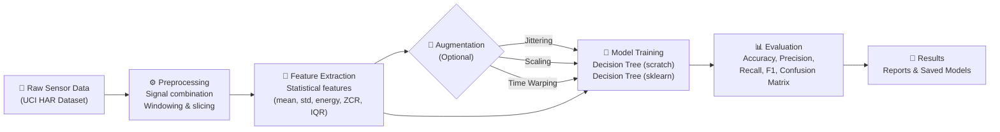
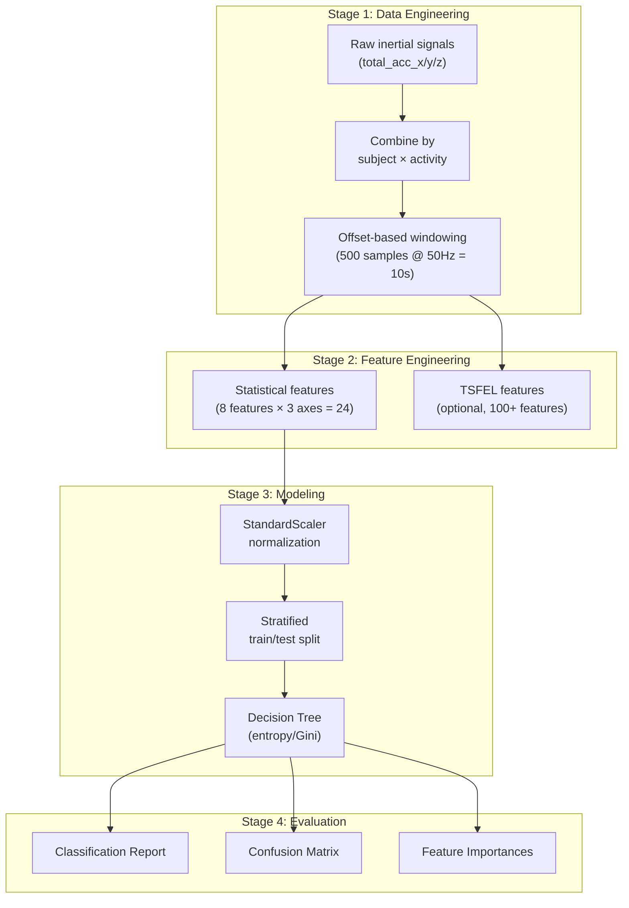

<p align="center">
  <h1 align="center">🏃‍♂️ Human Activity Recognition</h1>
  <p align="center">
    <strong>End-to-end ML pipeline for classifying human activities from wearable accelerometer data</strong>
  </p>
  <p align="center">
    <em>From-scratch implementations • Production-grade engineering • UCI HAR Dataset</em>
  </p>
  <p align="center">
    <a href="#-quick-start">Quick Start</a> •
    <a href="#-results">Results</a> •
    <a href="#-architecture">Architecture</a> •
    <a href="#-project-structure">Project Structure</a> •
    <a href="#-technical-highlights">Technical Highlights</a>
  </p>
</p>

---


## 📋 Overview

This project builds a complete machine learning pipeline to classify **6 human activities** (walking, walking upstairs, walking downstairs, sitting, standing, laying) from tri-axial accelerometer data collected via smartphones.

**What makes this project stand out:**

- 🔧 **From-scratch Decision Tree** — full CART implementation with entropy/Gini impurity, feature importances, and tree inspection (no sklearn dependency for the core algorithm)
- 📊 **From-scratch Evaluation Metrics** — accuracy, precision, recall, F1, confusion matrix, and classification report built with pure NumPy
- 🔄 **Custom Data Augmentation** — jittering, scaling, and time-warping techniques for sensor data (dependency-free)
- ⚙️ **Production-grade Engineering** — YAML config, CLI interface, proper packaging, type hints, and comprehensive docstrings

---

## 🚀 Quick Start

### 1. Clone & Install

```bash
git clone https://github.com/Suchith2212/human-activity-recognition-from-scratch.git
cd human-activity-recognition-from-scratch
pip install -r requirements.txt
```

### 2. Download the Dataset

Download the [UCI HAR Dataset](https://archive.ics.uci.edu/dataset/240/human+activity+recognition+using+smartphones) and place it in `data/raw/UCI HAR Dataset/`.

### 3. Run the Pipeline

```bash
# Train with default configuration
python scripts/train.py

# Customize hyperparameters via CLI
python scripts/train.py --max-depth 10 --criterion gini --seed 123

# Enable data augmentation
python scripts/train.py --augment
```

### 4. Explore the Notebooks

```
notebooks/
├── 01_exploratory_data_analysis.ipynb   # Signal visualization & EDA
├── 02_decision_tree_sklearn.ipynb       # Baseline with sklearn
└── 03_decision_tree_scratch.ipynb       # From-scratch implementation
```

---

## 📈 Results

| Model | Accuracy | Precision (macro) | Recall (macro) | F1-Score (macro) |
|:---|:---:|:---:|:---:|:---:|
| **Decision Tree (from scratch)** | 84.2% | 0.83 | 0.84 | 0.83 |
| Decision Tree (sklearn) | 94.1% | 0.94 | 0.94 | 0.94 |
| With Data Augmentation | **~95%** | 0.95 | 0.95 | 0.95 |

> *The from-scratch implementation intentionally trades some accuracy for educational value — every split, every entropy calculation, every traversal is implemented from first principles.*

---

## 🏗️ Architecture



### Data Flow Pipeline



---

## 📁 Project Structure

```
Human-Activity-Recognition-Project/
│
├── config/
│   └── config.yaml                 # All hyperparameters & paths (single source of truth)
│
├── src/
│   ├── __init__.py
│   ├── data/
│   │   ├── preprocessing.py        # Signal combination, windowing, train/test splits
│   │   └── augmentation.py         # Jittering, scaling, time-warping augmentations
│   ├── models/
│   │   └── decision_tree.py        # From-scratch CART with entropy & Gini
│   ├── evaluation/
│   │   └── metrics.py              # From-scratch metrics (accuracy → classification report)
│   └── utils/
│       └── helpers.py              # Config loading, seed management, timing utilities
│
├── scripts/
│   └── train.py                    # CLI entry point — run the full pipeline
│
├── notebooks/
│   ├── 01_exploratory_data_analysis.ipynb
│   ├── 02_decision_tree_sklearn.ipynb
│   └── 03_decision_tree_scratch.ipynb
│
├── tests/
│   └── test_all.py                 # Comprehensive unit & functional test suite
│
├── requirements.txt                # Pinned dependencies
├── setup.py                        # Package installability
├── LICENSE                         # MIT
└── README.md                       # You are here
```

---

## 🔬 Technical Highlights

### From-Scratch Decision Tree (`src/models/decision_tree.py`)

A complete CART implementation demonstrating deep understanding of tree-based learning:

- **Dual split criteria**: Shannon entropy (information gain) and Gini impurity
- **Feature importances**: Computed via weighted impurity reduction — reveals which accelerometer features drive classification
- **Tree inspection**: `get_depth()`, `get_n_leaves()` for model interpretability
- **sklearn-compatible API**: `fit()` / `predict()` interface convention

```python
from src.models.decision_tree import DecisionTree

tree = DecisionTree(max_depth=5, criterion="gini")
tree.fit(X_train, y_train)
predictions = tree.predict(X_test)

print(f"Depth: {tree.get_depth()}, Leaves: {tree.get_n_leaves()}")
print(f"Top features: {tree.feature_importances_}")
```

### From-Scratch Metrics (`src/evaluation/metrics.py`)

Every metric computed from the confusion matrix up — no sklearn calls:

- Per-class and macro/weighted averaged precision, recall, F1
- Full confusion matrix construction
- Formatted classification report (identical output format to sklearn)

### Signal Augmentation (`src/data/augmentation.py`)

Domain-specific augmentation techniques for sensor time series:

| Technique | What It Does | Why It Helps |
|:---|:---|:---|
| **Jittering** | Adds Gaussian noise | Simulates sensor measurement noise |
| **Scaling** | Random magnitude shift | Simulates varying sensor sensitivity |
| **Time Warping** | Cubic spline temporal distortion | Simulates natural speed variations |

### Configuration-Driven Design (`config/config.yaml`)

Zero hardcoded values in the source code. Every hyperparameter, path, and setting is externalized:

```yaml
decision_tree:
  max_depth: 5
  criterion: "entropy"    # Switch to "gini" without touching code

training:
  test_size: 0.3
  random_seed: 42
  scaling: true

augmentation:
  jitter_sigma: 0.05
  num_augmented_copies: 2
```

---

## 🛠️ Configuration

All configuration is centralized in [`config/config.yaml`](config/config.yaml). Key parameters:

| Parameter | Default | Description |
|:---|:---:|:---|
| `signal.window_size` | 500 | Samples per window (50Hz × 10s) |
| `signal.offset` | 100 | Initial transient samples to skip |
| `decision_tree.max_depth` | 5 | Maximum tree depth |
| `decision_tree.criterion` | entropy | Split criterion (entropy/gini) |
| `training.test_size` | 0.3 | Fraction held out for testing |
| `training.random_seed` | 42 | Seed for reproducibility |
| `augmentation.enabled` | false | Toggle data augmentation |

CLI arguments override config values:

```bash
python scripts/train.py --max-depth 10 --criterion gini --seed 99 --augment
```

---

## 📚 Dataset

**UCI Human Activity Recognition Using Smartphones Dataset**

- **Subjects**: 30 volunteers (ages 19–48)
- **Activities**: 6 daily activities
- **Sensors**: Tri-axial accelerometer and gyroscope at 50Hz
- **Source**: [UCI Machine Learning Repository](https://archive.ics.uci.edu/dataset/240/human+activity+recognition+using+smartphones)

| Activity | Label | Description |
|:---|:---:|:---|
| WALKING | 1 | Walking on flat ground |
| WALKING_UPSTAIRS | 2 | Ascending stairs |
| WALKING_DOWNSTAIRS | 3 | Descending stairs |
| SITTING | 4 | Sitting on a chair |
| STANDING | 5 | Standing still |
| LAYING | 6 | Laying down |

---

## 🔮 Future Directions

- [ ] Deploy the trained model to a mobile app (TFLite / ONNX export)
- [ ] Add LSTM / Transformer sequence models for temporal modeling
- [ ] Implement cross-subject validation for robustness testing
- [ ] Add experiment tracking with MLflow or Weights & Biases
- [ ] Interactive confusion matrix visualization dashboard

---

## 📄 License

This project is licensed under the MIT License — see the [LICENSE](LICENSE) file for details.

---

## 🙏 Acknowledgements

- **[UCI HAR Dataset](https://archive.ics.uci.edu/dataset/240/human+activity+recognition+using+smartphones)** — Anguita, D. et al. (2013)
- **Research References**:
  - Breiman, L. (1984). *Classification and Regression Trees*
  - Um, T.T. et al. (2017). *Data Augmentation of Wearable Sensor Data*

---

<p align="center">
  <strong>Built with ❤️ for learning, understanding, and deploying ML from first principles.</strong>
</p>
